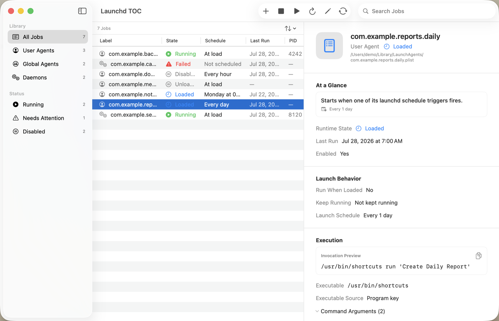
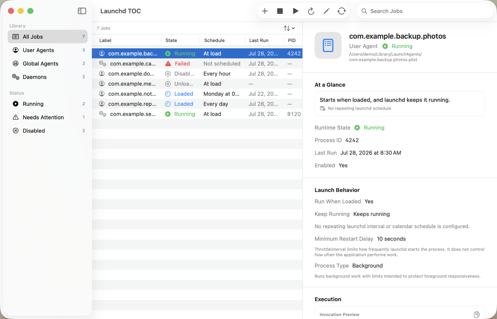
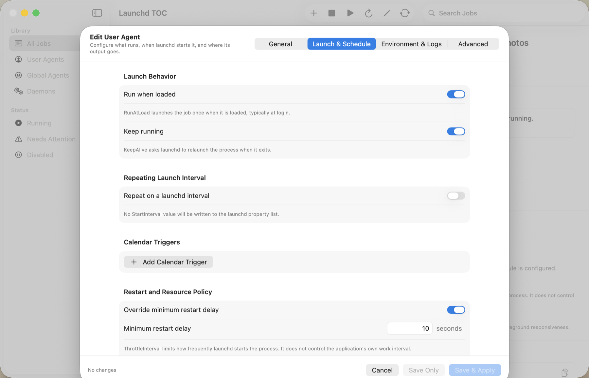

# Launchd TOC

Launchd TOC is a native macOS utility for inspecting launch jobs and safely managing user launch agents with a clear, system-native interface.

The project is an independent Swift/SwiftUI implementation. It does not contain source code, assets, interface copy, or icons from `azu/launchd-ui`.

The first supported release targets macOS 26 and is distributed as a Developer ID–signed, notarized universal application through GitHub Releases.

> Development is in progress. The first downloadable build will be `v0.1.0-beta.1`.

## Screenshots

Screenshots use synthetic demo data; no personal launchd configuration is included.

### Browse the inventory



### Understand a job



### Edit launch behavior



## Privacy and scope

- No analytics, accounts, or automatic network requests
- No privileged helper or administrator authentication
- Only `~/Library/LaunchAgents` is editable
- `/Library` and `/System/Library` launch jobs are always read-only
- Update checks occur only when explicitly requested
- No shell command strings; Apple tools are invoked by fixed executable URL and argument array

## Features

- Native three-column macOS interface with search, persistent selection, smart filters, and a sortable job table
- Runtime inspection through `launchctl print` and `print-disabled`
- Dock badge showing the number of currently running inventoried jobs
- Explicit load, unload, run, restart, enable, and disable workflows
- Behavior-first job details that distinguish launchd configuration from application output
- Guided, tabbed property-list editor with exact launchd values available for technical review
- Unknown and nested property-list values remain preserved when guided fields are saved
- XML and binary format preservation, `plutil` validation, atomic saves, and ten timestamped backups
- Calendar and interval schedule summaries with the next five predicted runs
- Bounded stdout/stderr tail with refresh, open, and safe clear controls
- Recoverable Move to Trash for user agents
- Explicit Help → Check for Updates against the stable GitHub release endpoint

## Requirements

- macOS 26 or later
- Apple Silicon or Intel Mac supported by macOS 26

## Build

Open `LaunchdTOC.xcodeproj` with Xcode 26.3 or later and run the `LaunchdTOC` scheme.

The checked-in project is generated from `project.yml`:

```sh
brew install xcodegen
xcodegen generate
xcodebuild -project LaunchdTOC.xcodeproj \
  -scheme LaunchdTOC \
  -destination 'platform=macOS' \
  test
```

The default test command runs both the unit and XCUITest suites using Xcode’s local development signing. GitHub-hosted CI runs the unit, command, persistence, schedule, update, and security suites on both Apple Silicon and Intel; macOS UI-test runners require a development signing identity and are therefore exercised locally.

Tests never use the developer’s real launch agents. The opt-in lifecycle integration test is gated by:

```sh
LAUNCHD_TOC_RUN_INTEGRATION_TESTS=1 \
  xcodebuild -project LaunchdTOC.xcodeproj \
  -scheme LaunchdTOC \
  -destination 'platform=macOS' \
  -only-testing:LaunchdTOCTests/IntegrationTests \
  test
```

Only disposable labels under `com.litsquare.launchdtoc.tests.*` are used.

## Distribution

Release tags trigger the GitHub Actions notarization pipeline documented in [docs/release.md](docs/release.md). The output is:

- `Launchd-TOC-<version>-universal.dmg`
- `Launchd-TOC-<version>-universal.dmg.sha256`

There is no App Store build, Sparkle framework, or automatic updater.

## Project documentation

- [Architecture and safety](docs/architecture.md)
- [Independent implementation provenance](docs/clean-room.md)
- [Release process](docs/release.md)
- [Contributing](CONTRIBUTING.md)
- [Security policy](SECURITY.md)

## Copyright

Copyright © 2026 Thierry Charbonnel. All rights reserved.

No license is granted for copying, modification, or redistribution unless provided separately in writing.
